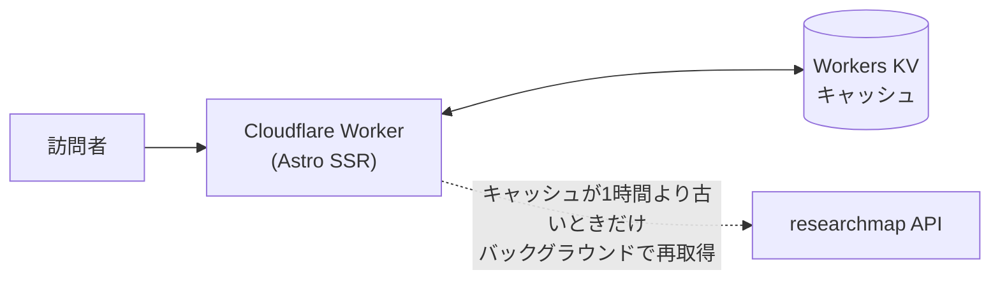

# researchmap-pages

[researchmap](https://researchmap.jp/) のデータから研究者向け個人サイトを生成するテンプレートです。[Astro](https://astro.build/) の SSR を [Cloudflare Workers](https://workers.cloudflare.com/) 上で動かし、researchmap API のデータを Workers KV にキャッシュして配信します。個人データはリポジトリにコミットされません。

デモ: https://kromiii.info

## 特徴

- **researchmap が Single Source of Truth** — 業績データはすべて researchmap 側で管理し、このリポジトリではサイトのデザインだけを自由にカスタマイズできる
- **更新作業ゼロ** — Cloudflare Workers + KV が researchmap の最新データを自動で反映するため、researchmap を更新すればサイトも追従する
- SSR で全コンテンツを HTML として返すため SEO・OGP に強い
- 日本語 / 英語の2ページ、直近90日の新着ハイライト、タブ UI、ダークモード対応

## 仕組み



- ページは常に KV のキャッシュから即座に描画され、古いデータは裏で更新される(stale-while-revalidate)
- 定期実行の CI が不要なため、GitHub Actions の「60日でスケジュールが止まる」問題と無縁
- researchmap API が落ちていても KV の古いデータで表示を継続

## 主なファイル

| ファイル | 役割 |
| --- | --- |
| `src/lib/researchmap.ts` | researchmap API の取得と KV キャッシュ(stale-while-revalidate) |
| `src/lib/view.ts` | 表示用データへの変換・タブ構成・新着抽出(90日) |
| `src/components/Page.astro` | ページ本体のテンプレートとタブ切り替え |
| `src/pages/avatar.jpg.ts` | アバター画像の KV キャッシュ配信 |
| `wrangler.jsonc` | Worker の設定(KV バインディング・カスタムドメイン) |

## セットアップ

1. **Use this template** から自分のリポジトリを作成する
2. [Cloudflare アカウント](https://dash.cloudflare.com/sign-up)(無料プラン可)を作成してログインする

   ```sh
   npm install
   npx wrangler login
   ```

3. KV namespace を作成し、表示された `id` を `wrangler.jsonc` の `kv_namespaces[0].id` に貼り付ける

   ```sh
   npx wrangler kv namespace create RESEARCHMAP
   ```

4. `wrangler.jsonc` を自分の環境に合わせる
   - `vars.RESEARCHMAP_PERMALINK` — researchmap のパーマリンク(`https://researchmap.jp/xxxx` の `xxxx`)
   - `name` — Worker 名
   - `routes` — 独自ドメインを使う場合はパターンを変更。`*.workers.dev` で試す場合は削除し、デプロイ後にダッシュボードでサブドメインを有効化
5. `astro.config.mjs` の `site` を公開 URL に変更する
6. デプロイする

   **方法A: Cloudflare の Git 連携(推奨)**

   Cloudflare ダッシュボード → Workers & Pages → **Create application → Import a repository** から対象の GitHub リポジトリを選択すると、Worker の新規作成と Git 連携が同時に完了します(事前に `wrangler deploy` で Worker を作っておく必要はありません)。以降は `main` ブランチへの push を Cloudflare 独自のビルド環境が検知して自動デプロイします。GitHub Actions は使われず(Cloudflare の GitHub App が push を検知してビルド・デプロイまで行う)、`wrangler login` や手動デプロイも不要になります。`vars` や KV namespace id など機密情報を含まない設定は `wrangler.jsonc` にコミット済みなので、追加の Secrets 登録も不要です。

   ※ ステップ3の KV namespace 作成だけは、この Git 連携より前に済ませておく必要があります(namespace id を `wrangler.jsonc` に書いてから push するため)。

   **方法B: 手動デプロイ**

   ```sh
   npm run deploy
   ```

デプロイが必要なのはコード変更時のみ。データ更新は Worker 自身が行うため CI や定期実行は不要です。

## ローカルでの確認

```sh
npm run dev        # 開発サーバー (http://localhost:4321)
npx wrangler dev   # 本番同等の Workers 実行環境 + ローカル KV
```

## License

[MIT](LICENSE)
